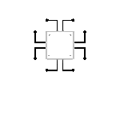

<!-- header here -->
<header>

    

    

</header>

<!-- -----------------------------------
                 About me 
    ------------------------------------ -->
## Hey There! 

    
    Passionate Developer, Constantly Exploring and Creating in the World of Tech and Beyond. On a Constant Journey of Transforming Ideas
    <!--  -->
     into Heartfelt Code 
    

<!-- ---------------------------------------
            Tech stack and skills 
    ---------------------------------------- -->
## My Tech Stack & Skills  

    

        

            
            
HTML5

        

        

            
            
JavaScript

        

        

            
            
CSS3

        

        <!-- 

            
            
React

        
 -->
    

    

    

        

            
            
Python

        

        

            
            
C Programming

        

        

            
            
Java

        

        

            
            
C++

        

        <!-- 

            
            
Node.js

        
 -->
    

    

    

        

            
            
MySQL

        

        

            
            
MongoDB

        

    

    

    

        

            
            
VS Code

        

        

            
            
GitHub

        

        

            
            
Git

        

    

<!--  -->

<!-- below wala....................... -->

<!--  -->

<!-- #gh-dark-mode-only -->

<!--  -->
<!--  -->

<!-- https://github.com/anuraghazra/github-readme-stats#use-githubs-new-media-feature -->

<!-- below wale//////////////////////// -->
<!-- 

 -->