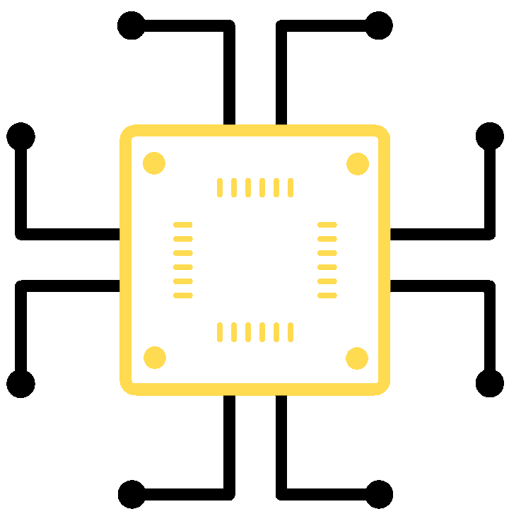
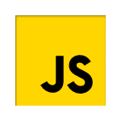

  
<header>
  <picture>
  <!-- for dark mode -->
    <source
      srcset="https://readme-typing-svg.demolab.com?font=Fira+Code&weight=500&size=30&pause=1000&center=true&vCenter=true&repeat=false&width=435&lines=SAHIL+GUPTA&color=36BCF7FF"
      media="(prefers-color-scheme: dark)"
    />
  <!-- for light mode -->
    <source
      srcset="https://readme-typing-svg.demolab.com?font=Fira+Code&weight=500&size=30&pause=1000&center=true&vCenter=true&repeat=false&width=435&lines=SAHIL+GUPTA&color=000000FF"
      media="(prefers-color-scheme: light), (prefers-color-scheme: no-preference)"
    />
    
  </picture>

  <picture>
  <!-- for dark mode -->
    <source
      srcset="https://readme-typing-svg.demolab.com?font=Fira+Code&pause=1000&center=true&vCenter=true&width=435&lines=Full-Stack+Software+Developer;Aspiring+Computer+Engineer;Transforming+Ideas%F0%9F%92%A1+Into+Code%F0%9F%92%96&color=36BCF7FF"
      media="(prefers-color-scheme: dark)"
    />
  <!-- for light mode -->
    <source
      srcset="https://readme-typing-svg.demolab.com?font=Fira+Code&pause=1000&center=true&vCenter=true&width=435&lines=Full-Stack+Software+Developer;Aspiring+Computer+Engineer;Transforming+Ideas%F0%9F%92%A1+Into+Code%F0%9F%92%96&color=000000F"
      media="(prefers-color-scheme: light), (prefers-color-scheme: no-preference)"
    />
    
  </picture>

<!-- 

    

    

 -->
</header>
 
 

<!-- -----------------------------------
                 About me 
    ------------------------------------ -->

    
 &nbsp;<strong>Hey There!</strong>&nbsp; 

    
    I'm a Passionate Developer, Constantly Exploring and Creating in the World of Tech and Beyond. On a Constant Journey of Transforming Ideas  
    <!--  -->
     into Heartfelt Code 
    

  

<!-- ---------------------------------------
            Tech stack and skills 
    ---------------------------------------- -->

 &nbsp;<strong>My Tech Stack & Skills</strong>&nbsp; 

<table align="center" width="100%">
  <tr title="Front-End Technologies">
    <td align="center">
        
        
HTML5

    </td>
    <td align="center">
        
        
JavaScript

    </td>
    <td align="center">
        
        
CSS3

    </td>
    <!-- <td align="center">
        
        
React

    </td> -->
  </tr>
  <tr title="Back-End Technologies">
    <td align="center">
        
        
Python

    </td>
    <td align="center">
        
        
C Programming

    </td>
    <td align="center">
        
        
Java

    </td>
    <td align="center">
        
        
C++

    </td>
    <!-- <td align="center">
        
        
Node.js

    </td> -->
  </tr>
  <tr title="Databases">
    <td align="center">
        
        
MySQL

    </td>
    <td align="center">
        
        
MongoDB

    </td>
  </tr>
  <tr title="Other Tools & Version Control">
    <td align="center">
        
        
VS Code

    </td>
    <td align="center">
        
        
GitHub

    </td>
    <td align="center">
        
        
Git

    </td>
  </tr>
</table>

 

<!-- -----------------------------
            Github Stats
    ------------------------------ -->

    <a>
        <picture>
        <!-- for dark mode -->
          <source
            srcset="https://github-readme-stats.vercel.app/api?username=shaanguptaa&show_icons=true&hide_rank=true&hide_border=true&title_color=36BCF7&theme=github_dark"
            media="(prefers-color-scheme: dark)"
          />
        <!-- for light mode -->
          <source
            srcset="https://github-readme-stats.vercel.app/api?username=shaanguptaa&show_icons=true&hide_rank=true&hide_border=true"
            media="(prefers-color-scheme: light), (prefers-color-scheme: no-preference)"
          />
                 
          </picture>
    </a>
<!--  -->
&nbsp;&nbsp;&nbsp;
<!-- languages used -->
    <a>
        <picture>
        <!-- for dark mode -->
          <source
            srcset="https://github-readme-stats.vercel.app/api/top-langs/?username=shaanguptaa&layout=compact&hide_border=true&title_color=36BCF7&theme=github_dark"
            media="(prefers-color-scheme: dark)"
          />
        <!-- for light mode -->
          <source
            srcset="https://github-readme-stats.vercel.app/api/top-langs/?username=shaanguptaa&layout=compact&hide_border=true"
            media="(prefers-color-scheme: light), (prefers-color-scheme: no-preference)"
          />
          
        </picture>
    </a>

 

<!-- streak score -->

    <picture>
    <!-- for dark mode -->
      <source
        srcset="https://streak-stats.demolab.com?user=shaanguptaa&hide_border=true&theme=github-dark-blue"
        media="(prefers-color-scheme: dark)"
      />
    <!-- for light mode -->
      <source
        srcset="https://streak-stats.demolab.com?user=shaanguptaa&hide_border=true"
        media="(prefers-color-scheme: light), (prefers-color-scheme: no-preference)"
      />
      
    </picture>

<!-- github stats alternate -->
<!--  -->

<!-- github trophies -->
<!--  -->

 
